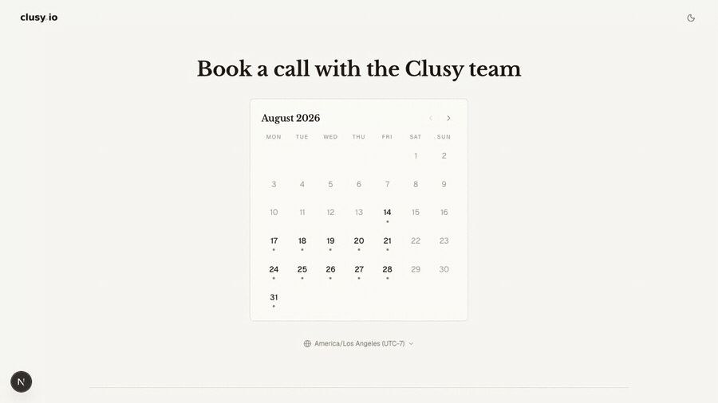
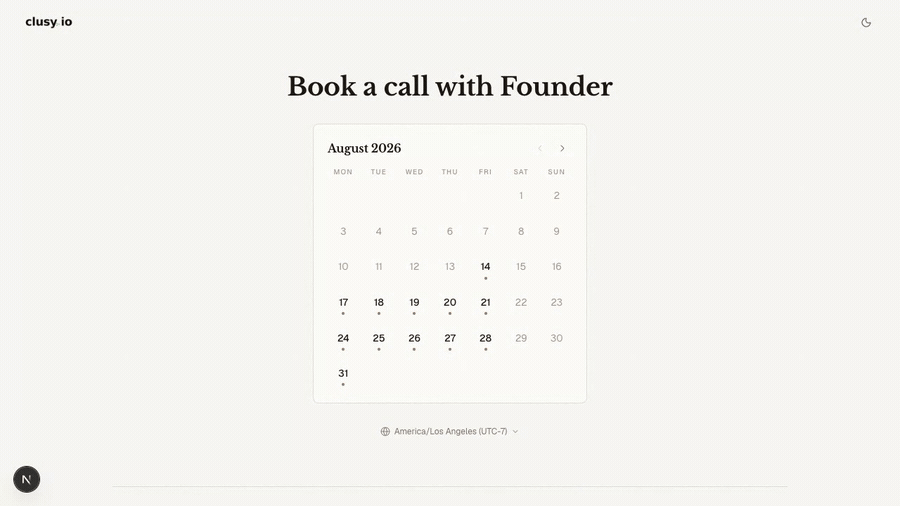
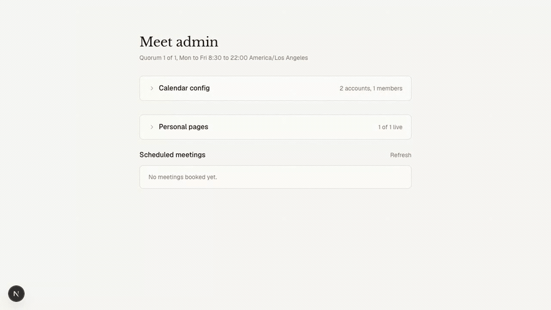

# meet

A polished, self-hosted scheduler for Google and Microsoft calendars. It finds
times when enough teammates are free, creates a video meeting, sends the
lifecycle email, and gives each booker a private link to reschedule or cancel,
without sending your visitors to a scheduling vendor.

<p align="center">
  
</p>

Built and operated by [Clusy](https://clusy.io). The production booking flow
runs at [clusy.io/meet](https://clusy.io/meet).

---

## What you get

**Team availability** across any mix of Google Calendar and Microsoft Outlook
accounts, with a configurable quorum and per-account busy calendars. A slot is
offered when enough people are genuinely free.

**A page per person**, alongside the team page. `/<member key>` books that one
person against their own calendar, with quorum set aside.

**A complete booking lifecycle**: confirmations with ICS attachments, guest
invites, self-service reschedule and cancel, and 24-hour and 1-hour reminders.

**Slack notifications**, per page, with a join button.

**Provider resilience**: organizer fallback, refresh-token rotation, request
timeouts, honest degraded sync states, and truthful copy when no video link
could be created.

**Timezone-safe scheduling** on IANA zones with DST-aware slot arithmetic.

**An admin console** for connecting accounts, choosing busy calendars,
configuring each personal page, and reviewing bookings with live RSVPs.

**Accessible, responsive UI** with keyboard focus management, reduced-motion
support, dark mode, and stable loading geometry.

**A zero-credential mock mode** with in-memory calendars and console email, so
you can evaluate the whole thing before creating a single account.

---

## Five-minute local start

Requirements: Node.js 22.13 or newer.

```bash
git clone https://github.com/clusy-io/meet.git
cd meet
npm install
cp .env.example .env.local
npm run dev
```

Open [http://localhost:3000](http://localhost:3000). The example environment
sets `MEET_MOCK_MODE=1`, so no database, OAuth client, or email account is
needed. The admin console is at
[http://localhost:3000/admin](http://localhost:3000/admin), open in mock mode.

---

## One page per person

The team page asks for a quorum. A personal page asks for one specific person,
so the times on offer are exactly when they are free.

<p align="center">
  
</p>

Each member in `MEET_MEMBERS` gets a page at their key: `/ada`, `/sam`, and so
on. Booking one person does not black out anybody else, because a confirmed
booking is overlaid onto exactly the people committed to it. Their email goes
to that one person rather than the whole team, and only they are put on the
calendar invite.

Personal pages are public and indexable. An unknown key is an ordinary 404, as
are the reserved segments (`/admin`, `/manage`, `/api`) and anything else with
no route of its own.

---

## Configured from the admin console, not a redeploy

Every personal page is edited at runtime: whether it is live, its hours, meeting
length, gap between slots, minimum notice, booking horizon, heading, calendar
event title, and its own Slack webhook.

<p align="center">
  
</p>

These live in the database rather than in environment variables precisely
because they are edited here: configuration is memoized for the life of the
process, so an env-backed setting would need a redeploy to take effect and
would differ between instances until then.

Every field is optional and means "inherit the team-wide value", so raising the
global window raises everyone's with it. A member with no stored row at all is
a live page running on inherited settings.

---

## Slack

Booked, rescheduled, cancelled, and both reminders post to an Incoming Webhook:

```
✅  Booked
Dana Okafor — call with Ada

When                              Duration
Thu, Sep 3, 2026, 9:30 PM PDT     30 minutes

[ Join the call ]
```

Each page can point at its own webhook, encrypted at rest; pages without one
fall back to the team webhook, so personal bookings stay visible to everyone
even though their email does not.

A Slack channel is a shared surface, so the message carries the event, the
times, the host, who booked, the join link, and a keyed reference. It never
carries the booker's email address, their notes, the guest list, or the manage
token, which is a bearer capability that would let anyone holding it move or
cancel the booking.

Delivery is best-effort by construction and can never fail a booking, delay the
response a visitor is waiting on, or cause a delivered reminder to be sent
twice. Set both `MEET_SLACK_WEBHOOK_URL` and `MEET_SLACK_ENABLED_AT` to switch
it on; the timestamp doubles as a cutoff, so turning it on never backfills
history.

---

## Architecture

```text
visitor  -> availability API -> Google / Microsoft free-busy
         -> booking API      -> Postgres booking + provider event + Resend + Slack
         -> /manage/[token]  -> reschedule or cancel

operator -> /admin -> OAuth connection, busy calendars, personal page settings
cron     -> /api/meet/cron/reminders -> 24-hour / 1-hour email
```

Next.js App Router throughout. Supabase is reached only with a server-side
service-role key; browsers never touch the database. OAuth refresh tokens and
per-page Slack webhooks are encrypted before storage. Management URLs are
bearer capabilities and are served `no-store`, `no-referrer`, and `noindex`.

Availability splits its caching deliberately: provider free-busy is cached
briefly per instance, while confirmed bookings are read fresh on every request,
because the database is the only state shared across instances. A calendar that
cannot be read is treated as busy, never as free.

---

## Production setup

1. Create a Supabase project and run [`docs/schema.sql`](docs/schema.sql) in the
   SQL editor. It is additive and re-runnable; re-running it is the upgrade path.
2. Register Google and/or Microsoft OAuth applications with the callback URLs in
   [`docs/SETUP.md`](docs/SETUP.md).
3. Verify a sending domain in Resend.
4. Configure production from `.env.example`, leave `MEET_MOCK_MODE` empty, and
   use independent random values for every secret.
5. Deploy, open `/admin`, connect each member's accounts, and choose the
   calendars that count as busy.
6. Make one real booking, reschedule it, cancel it, and check the provider
   events, the email, the private response headers, and the reminder cron.

Never put production service-role, OAuth, or calendar credentials in preview
deployments. Use an isolated preview project, or leave mock mode on there.

The full [setup and operations guide](docs/SETUP.md) covers every variable,
OAuth scope, callback, and deployment check.

---

## Configuration

Public branding lives in [`src/meet.config.ts`](src/meet.config.ts). Forks
usually only edit that file and replace the images in `public/`. Everything
else is environment-driven:

| Group | Variables |
| --- | --- |
| Identity | `NEXT_PUBLIC_SITE_URL`, `MEET_BRAND_NAME`, `MEET_EMAIL_FROM` |
| Team | `MEET_MEMBERS`, `MEET_QUORUM`, `MEET_HOST_TIMEZONE` |
| Window | `MEET_WINDOW_START`, `MEET_WINDOW_END`, `MEET_DURATION_MINUTES`, `MEET_SLOT_STEP_MINUTES`, `MEET_MIN_NOTICE_MINUTES`, `MEET_HORIZON_DAYS` |
| Security | `MEET_ADMIN_SECRET`, `MEET_TOKEN_SECRET`, `CRON_SECRET` |
| Storage | `SUPABASE_URL`, `SUPABASE_SERVICE_ROLE_KEY` |
| Providers | `MEET_GOOGLE_*`, `MEET_MICROSOFT_*`, `RESEND_API_KEY` |
| Slack | `MEET_SLACK_WEBHOOK_URL`, `MEET_SLACK_ENABLED_AT` |

Configuration fails closed. An invalid window, timezone, sender, member list,
quorum, or duration stops the process rather than quietly falling back to
something unsafe, and the values that cannot be guessed are required outside
mock mode.

Per-page settings are the deliberate exception: they are stored in the database
so the admin console can change them without a deploy.

---

## Routes

| Route | Purpose |
| --- | --- |
| `/` | Team booking page |
| `/<member key>` | One person's booking page |
| `/manage/[token]` | Private bearer-link booking management |
| `/admin` | Secret-gated operator console |
| `/api/meet/availability` | Public availability, optionally `?host=<member key>` |
| `/api/meet/bookings` | Booking lifecycle APIs |
| `/api/meet/admin/pages` | Personal page settings |
| `/api/meet/oauth/*` | Google and Microsoft connection flow |
| `/api/meet/cron/reminders` | Secret-gated reminder worker |

`/<member key>` is a root dynamic segment, so static routes win over it: the
segments above keep their own pages. Everything else falls through and 404s.

---

## Tests

```bash
npm run lint
npm run typecheck
npm test
npm run build
# or all four
npm run check
```

The suite covers timezone maths, intervals, slot generation, configuration,
encryption, storage concurrency, per-page slot isolation, request origin checks,
email routing, reminders, Slack payloads and delivery classification, Microsoft
provider behaviour, provider fallback, and stale reschedule rejection.

Some behaviour a unit test cannot see. The booking page's time column has four
properties that must hold at once, all of them facts about layout and component
lifecycle that only a real browser can observe, and each of them has been
broken by a fix to one of the others:

```bash
MEET_MOCK_MODE=1 npm run dev
node docs/slotpicker-invariants.mjs http://localhost:3000
```

It needs `playwright-core` and a local Chrome build, taken ad hoc rather than
carried as a dependency:

```bash
npm i --no-save playwright-core && npx playwright install chromium
```

---

## Operational limits

- The bundled rate limiter is in-memory and per process. Public, high-traffic
  deployments should add a distributed limiter and a bot challenge at the edge.
- Reminders send before they mark. That protects against silent loss, but an
  overlapping cron run or a crash after sending can produce a duplicate. Use a
  durable leased outbox if you need exactly-once.
- Slack delivery is best-effort and is not retried. It is deliberately unable to
  fail a booking, which is the trade being made.
- Provider timeouts are ambiguous: a calendar provider can accept an event just
  as the local request aborts. Periodic reconciliation is wise for critical
  deployments.
- The schema does not purge booking history. Choose a retention period that
  matches your privacy notice and add a scheduled cleanup.
- The Microsoft refresh single-flight is process-local. Multiple instances still
  want a database-level compare-and-swap for strict rotation.

---

## Security and privacy

Read [`SECURITY.md`](SECURITY.md) before production use. Bookings hold names,
email addresses, notes, guest addresses, timestamps, event references, and
encrypted provider tokens. Publish an accurate privacy notice, limit access,
choose a retention period, and review Supabase, Google, Microsoft, Resend, and
your host as subprocessors.

---

## Contributing

Contributions are welcome. See [`CONTRIBUTING.md`](CONTRIBUTING.md) and
[`CODE_OF_CONDUCT.md`](CODE_OF_CONDUCT.md). Please report vulnerabilities
privately rather than in a public issue.

## License

[MIT](LICENSE) © Clusy Inc. The Clusy name and logos are not licensed for use as
the identity of modified deployments; see [`NOTICE.md`](NOTICE.md).
